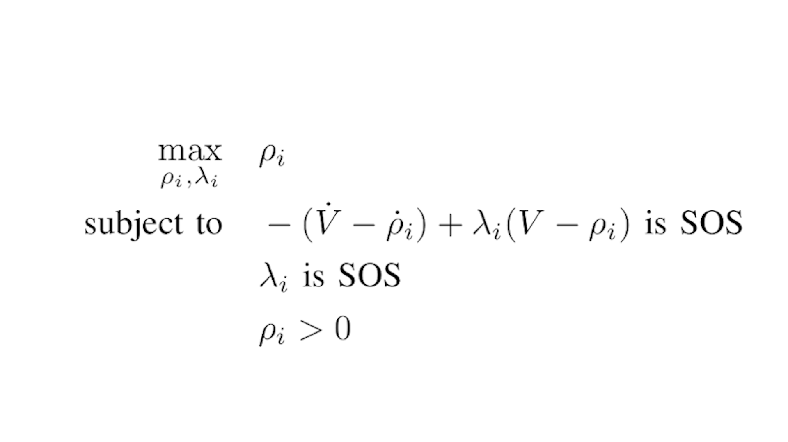

# SOS-bilinear-alternation
This repository aims to store my implementation of the SOS bilinear alternation for a torque limited simple pendulum. 

Current state: the estimation is succeeding in providing me a meaningful Funnel but the verification gives me some fails, teoretically I am not expecting such fails since I am implementing an inner estimation of the RoA.

## Implementation description #
This implementation provides a time-varying estimation of the region of attraction(RoA). The obtained state region is called "Funnel". This analysis permits to observe, under a time-varying LQR stabilization, how far the state of the system can deviate from the nominal trajectory and remain stable. 

By approximating the pendulum dynamics as a polynomial one via Taylor expansion, this problem can be formulated in an optimization problem via SOS optimization. The problem formulation is the following one:



The python bindings of the C library "drake" has been exploited to deal with such an optimization problem. The autogenerated python documentation can be found [here](https://drake.mit.edu/pydrake/pydrake.all.html).

My implementation of the bilinear alternation that is needed to solve this problem relies on the ones described in the following literature:
    
- ["Invariant Funnels around Trajectories using Sum-of-Squares Programming", Mark M. Tobenkin, Ian R. Manchester, Russ Tedrake](https://doi.org/10.48550/arXiv.1010.3013)
- ["Funnel libraries for real-time robust feedback motion planning", Anirudha Majumdar, Russ Tedrake](https://doi.org/10.1177/0278364917712421)
- ["Trajectory Optimization and Time-Varying LQR Stabilization of Airplane Longitudinal Dynamics", Benjamin Thomsen](https://github.com/benthomsen/mit-6832-project/blob/master/bthomsen-6832-report.pdf)

## Software installation #
In order to use this repository the user should clone the repository in a local folder. Then, inside the project folder, run "pip install ." in order to install the needed packages.

```
Warning: this procedure should be done in a virtual environment. I used "pipenv" for example and hence, after creating the environment with "pipenv shell", the command to run will be "pipenv install .".
```